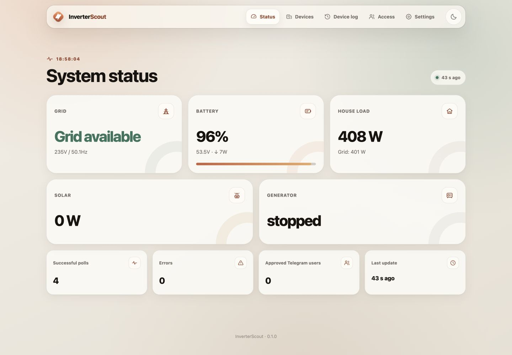
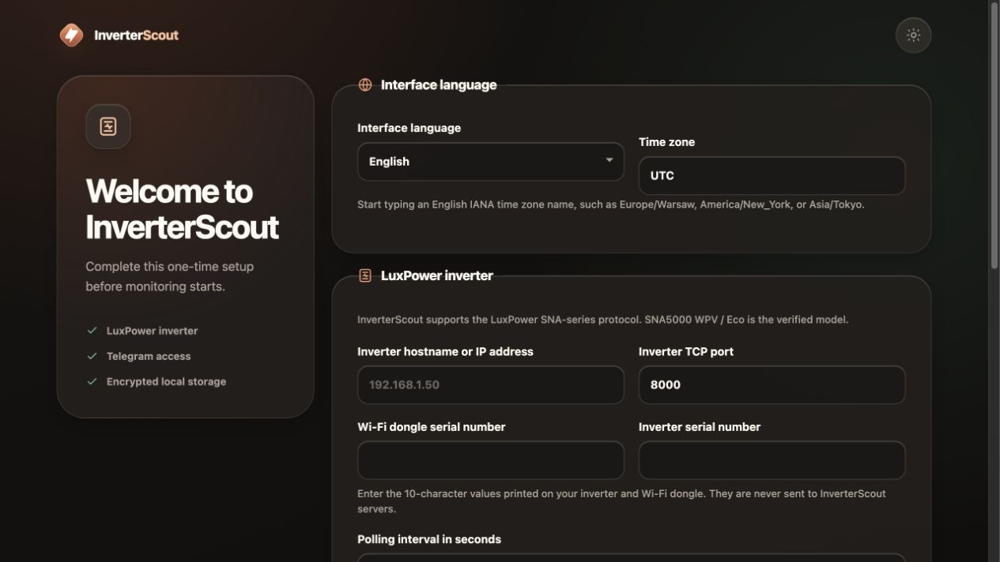
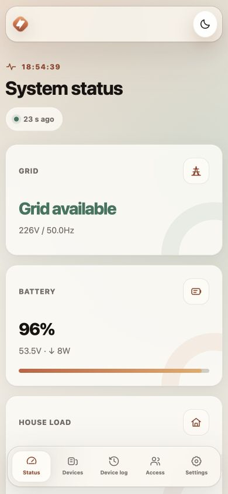
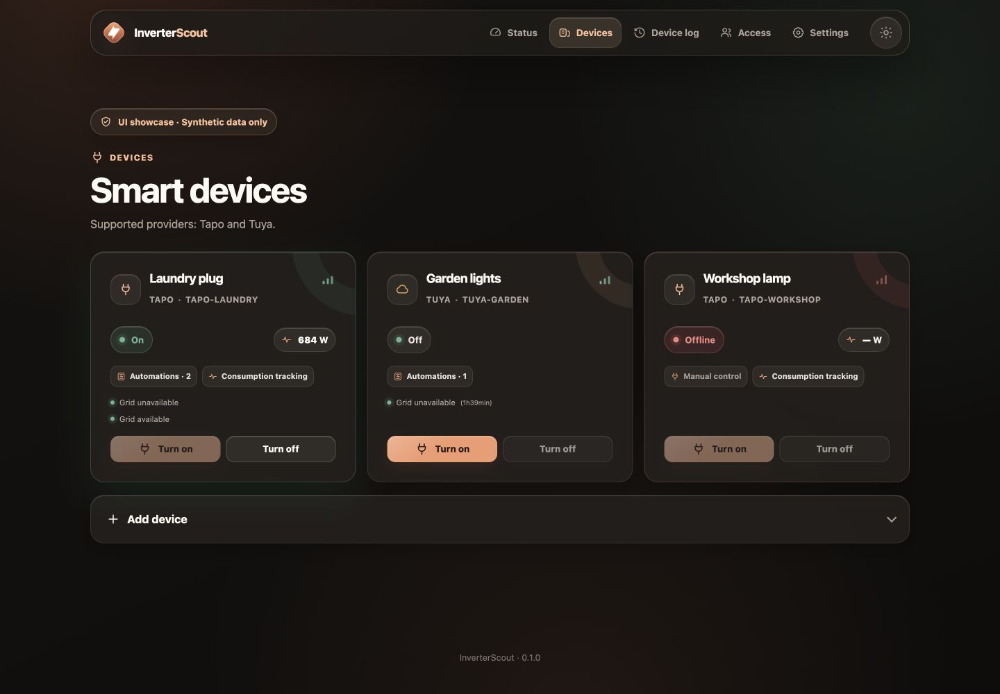
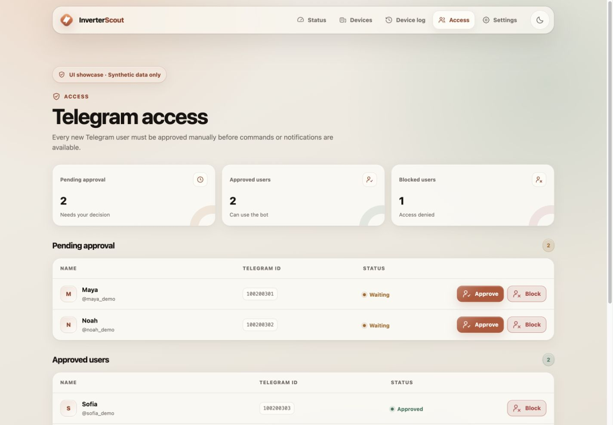
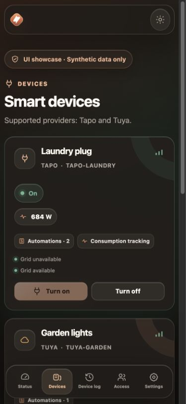

# InverterScout

[](LICENSE)
[](#quick-start)
[](https://www.python.org/)
[](#quick-start)
[](https://github.com/albond/InverterScout/actions/workflows/ci.yml)
[](https://github.com/albond/InverterScout/actions/workflows/codeql.yml)

[](#security-model)
[](#security-model)
[](#security-model)
[](#security-model)

[](https://github.com/albond/InverterScout)
[](https://github.com/albond/InverterScout/commits/main)
[](https://github.com/albond/InverterScout/issues)
[](#-support-the-project)

InverterScout is a self-hosted monitor for selected LuxPower SNA inverters and Tapo or Tuya smart devices. It reads inverter input registers without writing to the inverter, shows a local dashboard, and can send alerts through a private Telegram bot.

The application is designed for a trusted home network. The Web UI is for use inside that network. Telegram is the supported way to interact with the system while away from home.

<picture>
  <source media="(prefers-color-scheme: dark)" srcset="docs/screenshots/dashboard-dark.jpg">
  
</picture>

> **Project status:** alpha. The software has automated and container-level coverage, but real hardware validation is still required before relying on it for critical operations.

## Quick Start

No Python installation or manual `.env` editing is required. Use the launcher for the operating system from the extracted InverterScout directory:

| Operating system | Command |
| --- | --- |
| Linux or macOS | `chmod +x start.sh && ./start.sh` |
| Windows | `start.bat` |

The launcher guides the deployment from start to finish:

1. Choose Docker on the current computer, a home NAS/Docker-capable Arduino Linux board, or a remote Linux server.
2. Choose whether the Web UI is available only on this computer or also to other devices on a trusted home LAN.
3. Select the Web UI port. If it is occupied, the launcher suggests a nearby free port.
4. Enter the inverter hostname/IP and start with TCP port `8000`; the logger or firmware may use a different port.
5. Build the image and optionally test the inverter connection from the same container network used by InverterScout.
6. Start the service, wait for its healthcheck, and open the first-run browser wizard.

The only host port published by InverterScout is the Web UI port. The launcher checks it before startup. SQLite, Telegram, Tapo, and Tuya do not open additional host ports.

### Local Docker

Choose **Docker on this computer**. The launcher verifies the Docker CLI, Docker Compose v2, and the Docker daemon. On macOS and Windows it can start Docker Desktop when Docker is installed but not running. On Linux, start the Docker service using the method provided by the distribution.

The recommended Web UI mode binds to `127.0.0.1`. Choose **Other devices on this trusted home LAN** when household devices need direct access. The launcher detects the Docker host's private LAN IPv4 address when possible, lets you confirm it, and publishes the selected Docker port on that address. Other devices then use a URL such as `http://192.168.1.20:8080`. The launcher never offers a public `0.0.0.0` bind.

On Windows, the launcher can add or refresh an inbound Windows Firewall rule restricted to the selected local address, the selected TCP port, the `Private` network profile, and `LocalSubnet`. This step may require running `start.bat` as Administrator. macOS, Linux, NAS, and third-party firewalls are not changed automatically; if they block the connection, allow only the selected TCP port from the trusted local subnet.

LAN publication is not internet publication. Never configure router port forwarding, UPnP, or a public tunnel for the Web UI. Use Telegram or a private VPN when away from home.

### Remote Docker over SSH

Choose **Home NAS or Docker-capable Arduino Linux board over SSH** for a device on the home network, or **Remote Linux server over SSH** for an off-site/private-VPN deployment. Docker does not need to be installed on the current computer, but these client tools must be available:

- `ssh`, `scp`, and `tar`
- On Windows, Windows PowerShell and the optional OpenSSH Client feature

The remote host must have Docker Engine, Docker Compose v2, `tar`, and an SSH account permitted to use Docker. The launcher asks for the remote hostname/IP, SSH port, username, and either:

- password authentication — the password is requested directly by OpenSSH and is never read, logged, or stored by InverterScout; or
- private-key authentication — the selected key stays on the current computer and is never uploaded.

Password authentication may prompt twice: once for the secure upload and once for the remote installation. The launcher uploads a runtime-only archive, validates it before extraction, builds a versioned release under `~/.local/share/inverterscout/releases/`, and keeps application data in the persistent `inverterscout_inverterscout_data` Docker volume.

For a server outside the home network, use the default **SSH tunnel only** mode. The launcher prints the exact tunnel command and local URL. A remote server can monitor the inverter only when it has a private routed path to the inverter network, such as the same LAN, an allowed VLAN route, or a private VPN. Do not expose either the Web UI or the inverter port through public router forwarding.

### How Docker reaches the inverter

The inverter TCP port is deliberately **not** added to the Compose `ports` section. Port publishing is for connections entering a container; InverterScout makes an outbound connection from the container to the inverter instead:

```text
InverterScout container  ──TCP──>  inverter-host:8000
```

The Docker host must therefore be able to route traffic to the inverter address. Docker bridge networking normally permits this for devices on the same home LAN. VLAN isolation, NAS firewall rules, guest Wi-Fi, or a remote server without a VPN can block it. The launcher's connectivity test runs inside the application image and stops before startup by default when this route fails.

The launcher uses the inverter address only for that temporary test and does not save it in `.env`. Enter it again in the first-run browser wizard, where it is written to the encrypted local database together with the remaining settings.

After deployment, complete these browser steps:

1. Select the interface language, then start typing and choose an English IANA time zone name from autocomplete.
2. Enter the inverter address, TCP port, Wi-Fi dongle serial, and inverter serial.
3. Choose a polling interval.
4. Configure a private Telegram bot or explicitly choose operation without Telegram.
5. Follow the [device connection guide](docs/DEVICE_SETUP.md), then add Tapo or Tuya credentials in Settings and devices in Devices.

See the [deployment guide](docs/DEPLOYMENT.md) for prerequisites, troubleshooting, update paths, and service-management commands. The device guide explains the supported LuxPower dongle flow, Tapo account requirements, and the mandatory Tuya Developer Cloud project.

## Interface

The responsive Web UI includes an assisted first-run setup, local energy dashboard, smart-device controls, event history, Telegram access approval, and encrypted credential settings. It follows the operating system appearance by default and can be switched between light and dark at any time.

| First-run setup | Mobile dashboard |
| --- | --- |
|  |  |

| Smart-device states and controls | Telegram access approval |
| --- | --- |
|  |  |

<p align="center">
  
</p>

## Architecture

InverterScout is an installable Python package with explicit domain boundaries:

```text
src/inverterscout/
├── core/          Events, state transitions, automation scenarios
├── devtools/      Isolated synthetic UI showcase
├── devices/       Device model and Tapo/Tuya integrations
├── interfaces/    Local Web UI and Telegram adapter
├── inverter/      Passive LuxPower protocol reader
├── security/      Credential-safe logging
├── settings/      Runtime settings, i18n, first-run wizard
├── storage/       Encrypted SQLite document store
└── resources/     Templates, static assets, JSON locale catalogs
```

Tests are separated into `unit`, `integration`, and `security` suites. See [Architecture](docs/ARCHITECTURE.md) for dependency boundaries, startup lifecycle, persistence, and safety invariants.
Release history is maintained in [CHANGELOG.md](CHANGELOG.md).

## Hardware compatibility

### LuxPower inverters

| Status | Model | Rated output | Notes |
| --- | --- | ---: | --- |
| **Verified** | SNA5000 WPV | 5 kW | Development and hardware validation are performed on this model. LuxPowerTek markets the family as Eco Hybrid SNA 3–5K. |
| **Expected compatibility — unverified** | SNA3000 WPV | 3 kW | Uses the same documented SNA 3–6K family platform. |
| **Expected compatibility — unverified** | SNA4000 WPV | 4 kW | Uses the same documented SNA 3–6K family platform. |
| **Expected compatibility — unverified** | SNA6000 WPV | 6 kW | Uses the same documented SNA 3–6K family platform. |
| **Experimental — unsupported** | SNA-EU 12000 / 14000 | 12–14 kW | This higher-power family has separate manufacturer documentation and has not been protocol-tested with InverterScout. |

LuxPowerTek documents SNA3000 WPV, SNA4000 WPV, SNA5000 WPV, and SNA6000 WPV in the same [official SNA 3–6K manual](https://luxpowertek.com/wp-content/uploads/2025/12/SNA-3-6K-User-manual-English-OffGrid-Single-Phase-LuxpowerTek.pdf). Expected compatibility for the 3, 4, and 6 kW models is an engineering inference from that shared product family, not a completed hardware test. The SNA-EU 12–14K models use a [separate manufacturer manual](https://luxpowertek.com/wp-content/uploads/2025/08/SNA-12-14K-User-Manual-2025.6.27.pdf) and should be treated as experimental.

### Three-phase warning

Native three-phase models and configurations sold as `SNA 6000–12000 X3` or `SNA 10K/12K/15K Three Phase` are **not currently supported**. They may use a related polling protocol, but InverterScout currently models a single phase and does not aggregate or validate R, S, and T phase measurements. A device may connect while displaying incomplete or incorrect values.

Do not rely on an experimental model for automation or critical monitoring. Every voltage, power, battery, grid, and generator value must be independently verified before reporting a model as compatible. Hardware reports should include the exact model designation and sanitized diagnostic data without serial numbers or credentials.

### Smart devices and deployment hosts

- Tapo switches and bulbs supported by the bundled, unofficial Tapo local API library; pair them in the official Tapo app first and check the library's [current package documentation](https://pypi.org/project/tapo/)
- Tuya LAN switches and bulbs using a Local Key obtained from an authorized [Tuya Developer Cloud](https://platform.tuya.com/cloud/) Smart Home project; consumer-app credentials alone are not sufficient
- Docker hosts on x86-64 or ARM64 Linux, a home computer, or a NAS
- Docker-capable Arduino Linux boards such as Portenta X8 are an experimental target

An ordinary Arduino microcontroller cannot run Docker or this Python service. Portenta X8 is different because it includes a Linux processor and supports containerized applications. No Portenta X8 hardware test has been completed yet.

## Security model

- First-run setup is mandatory. Monitoring does not start until Telegram is configured or explicitly disabled.
- Every new Telegram user is pending until an administrator approves the numeric chat ID in the local Access page.
- Settings, device credentials, Telegram user lists, event history, and runtime state are encrypted before being stored in a local SQLite database.
- Secret values are never rendered back into the Settings page. A credential can only be replaced.
- The Docker container drops Linux capabilities, uses a read-only root filesystem, and runs without privilege escalation.
- The inverter code only builds Modbus `0x04` Read Input Register requests. It must never send write functions.

The database encryption key is stored separately at `/app/data/.master.key` with mode `0600` unless `INVERTERSCOUT_MASTER_KEY` is injected at runtime. Keeping the generated key beside the database protects against an isolated database copy, not a complete host compromise. For stronger separation, inject the key through the container platform's secret manager and back it up separately.

See [SECURITY.md](SECURITY.md) for the full threat model and credential guidance.

## Manual Docker Compose

The interactive launcher is recommended. For a manual local deployment, first verify that port `8080` is free, then create the environment file and start Compose:

```sh
cp .env.example .env
docker compose up -d --build
```

The example binds the Web UI to `127.0.0.1`. To use the dashboard from other devices on the same trusted LAN, set the Docker host's LAN address in `.env` before startup:

```dotenv
INVERTERSCOUT_BIND_ADDRESS=192.168.1.20
INVERTERSCOUT_WEB_PORT=8080
```

Use the actual address of the computer or NAS running Docker, not the inverter address. Manual deployment does not perform the launcher's port, Docker, inverter-route, or health checks.

Do not configure router port forwarding, UPnP exposure, a public reverse proxy, or a public tunnel for this port. If the Web UI must cross networks, use an SSH tunnel or a private VPN with authentication and firewall rules. Telegram remains the normal remote-access channel.

## Installation notes

### Home computer

Run the Quick Start launcher in a dedicated directory. On macOS or Windows, keep Docker Desktop running. On Linux, enable the Docker service so the container can restart after a power failure.

### NAS

Create a project in the NAS container manager from `docker-compose.yml`, keep the named volume mounted at `/app/data`, and publish port `8080` only on the NAS LAN address. The container needs outbound internet access only when Telegram is enabled or Tuya device metadata and Local Keys are retrieved, plus local TCP access to the inverter and smart devices. Existing Tuya devices are controlled over the LAN after their Local Keys have been stored.

### ARM64 single-board computer

Clone or copy the source onto the board and run the same Compose commands. The Python base image supports ARM64. Device-library compatibility should be verified on the target board before relying on automation.

### Arduino Portenta X8

Use only the Linux side of a Portenta X8 or another Docker-capable Arduino Linux product. Build an ARM64 image, provide persistent storage for `/app/data`, and make sure the container can reach the inverter's LAN. This target is experimental until a real hardware run is documented.

For the beginner flow, run the launcher on a home computer and choose **Home NAS or Docker-capable Arduino Linux board over SSH**. Enter the board's SSH address and credentials. The launcher defaults to trusted-LAN Web UI access, suggests the board's private SSH address when it is an IPv4 address, and publishes the selected Docker port on that address. Household devices can then open a URL such as `http://192.168.1.30:8080`. If the project is already stored on the board and the launcher is run there directly, choose local Docker and then **Other devices on this trusted home LAN**.

The board must run Linux, SSH, Docker Engine, and Docker Compose v2. Ordinary Uno, Nano, Mega, and similar microcontroller-only boards cannot run InverterScout. A Linux firewall on the board may still need an inbound rule restricted to the selected port and home subnet; the launcher does not request `sudo` or change the board firewall automatically.

Review the official [Portenta X8 hardware documentation](https://docs.arduino.cc/hardware/portenta-x8) and [Portenta X8 FAQ](https://support.arduino.cc/hc/en-us/articles/15579050846364-FAQ-Arduino-Portenta-X8) before deployment because its Linux container workflow differs from a typical PC or NAS.

## Languages

The setup wizard and interface support:

- English
- Ukrainian
- Spanish
- Arabic, including RTL layout
- German
- Polish
- Romanian
- Japanese
- Korean
- Chinese

Locale catalogs live in `src/inverterscout/resources/locales/<language>.json`. To add a language, copy `en.json`, translate every value without changing its key, and register the language in `src/inverterscout/settings/i18n.py`. Catalog validation reports missing keys and changed placeholders.

## Backup and recovery

Compose stores persistent data in the `inverterscout_inverterscout_data` Docker volume. Back up both of these files from that volume:

- `/app/data/inverterscout.db`
- `/app/data/.master.key`, or the external `INVERTERSCOUT_MASTER_KEY`

The database cannot be decrypted without the matching key. Do not place either item in Git, a public issue, or a diagnostic archive. Keep at least one key backup separate from the database backup.

## Development

```sh
python -m venv .venv
source .venv/bin/activate
python -m pip install -e ".[dev]"
make lint
make test
```

Tests do not contact live inverter, Telegram, Tapo, or Tuya accounts. Hardware access must remain opt-in and read-only for the inverter.

To review every populated UI state without credentials or hardware, run the isolated showcase:

```sh
python -m inverterscout.devtools.showcase --port 2301
```

Open `http://127.0.0.1:2301`. The showcase binds to loopback by default and keeps its inverter readings, Tapo/Tuya devices, power values, event log, settings, and Telegram allowlist entirely in memory. It never contacts a device, Telegram, or a provider cloud. Use `--language ar` (or another supported language code) to review localization and RTL layouts.

Useful commands:

| Command | Purpose |
|-|-|
| `make run` | Start the package locally |
| `make showcase` | Start the isolated UI showcase on `127.0.0.1:2301` |
| `make format` | Apply import sorting and formatting |
| `make lint` | Run static checks and verify formatting |
| `make test` | Run all unit, integration, and security tests |
| `make test-cov` | Run the test suite with branch coverage |
| `make docker-build` | Build the production container |

Contribution requirements are documented in [CONTRIBUTING.md](CONTRIBUTING.md).

## 💝 Support the project

InverterScout is free under the MIT license and will stay that way. If it saves enough time to be worth a coffee, a stablecoin tip can be sent directly to this EVM address:

```text
0xF734F20bFeB7ddb3f0519ADAfbBa056939c9C261
```

Supported networks:

| Network | Tokens |
|-|-|
| **Polygon** (recommended) | USDC · USDT |
| **Ethereum mainnet** | USDC · USDT · EURC |

Double-check the token and network before sending. Do not send through TRC-20, BSC, Arbitrum, Base, Solana, or another network; an incompatible transfer may be unrecoverable.

## Contact

- Bugs and feature requests: GitHub Issues
- Other contact: `albond.dev@proton.me`

## License

[MIT](LICENSE) © 2026 albond
