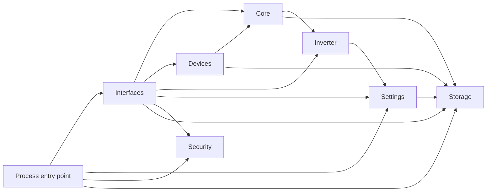

# Architecture

InverterScout uses a `src`-layout Python package with explicit responsibility boundaries. The process is local-first: device and account data stays on the host, while the Web UI and Telegram interface consume the same application state.

## Package boundaries

```text
src/inverterscout/
├── __main__.py            Process entry point and startup gate
├── core/                  Events, state transitions, and scenarios
├── devices/               Provider-neutral device model plus Tapo/Tuya adapters
├── interfaces/            Web UI and Telegram delivery adapters
├── inverter/              Passive LuxPower protocol reader
├── security/              Credential-safe logging
├── settings/              Runtime configuration, localization, setup wizard
├── storage/               Authenticated encrypted persistence
└── resources/             Templates, static files, and locale catalogs
```

The package dependency direction is explicit and intentionally acyclic:



`__main__.py` is the process entry point and setup gate. The Telegram runtime adapter is the current composition layer for provider registration and long-running tasks, including installations that disable Telegram. Domain state does not depend on a Web framework or Telegram objects.

## Startup lifecycle

1. Open or create the encrypted local store.
2. Block startup in the first-run wizard until configuration is valid.
3. Apply the selected IANA time zone.
4. Initialize state, smart-device providers, and automation scenarios.
5. Start the local Web UI and optional Telegram polling.
6. Poll the inverter through passive read requests and publish domain events.

## Persistence

The storage layer presents JSON-document semantics to the application and writes authenticated Fernet ciphertext into SQLite. Logical record names are hashed. Settings, provider credentials, device configuration, Telegram access lists, events, and runtime state use this layer.

The master key is separate from the database. A default installation stores both in the persistent Docker volume; stronger deployments inject the key from the host platform.

## Safety invariants

- Inverter transport builds only Modbus `0x04` Read Input Registers requests.
- Pending and blocked Telegram users receive neither commands nor broadcast notifications.
- Saved credentials are never rendered back into HTML.
- Known credentials are redacted from complete formatted log records, including tracebacks.
- The Web UI has no public-internet operating mode.
- Automated tests never contact live hardware or vendor accounts.

## Test strategy

```text
tests/
├── unit/          Isolated domain, provider, protocol, and interface behavior
├── integration/   Cross-module event flow and HTTP application contracts
└── security/      Encryption, redaction, and public-tree leak prevention
```

The CI quality gate checks import ordering, static errors, formatting, and the complete pytest suite on Python 3.12.
